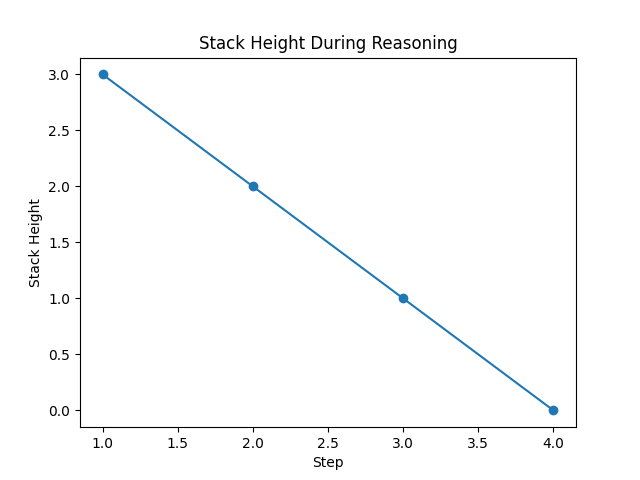

# 🧠 Stack-Augmented Decoding Framework for Structured Prompt Processing

## 📌 Introduction
Large Language Models (LLMs) are powerful but often lack transparency in their
reasoning process. When solving complex or structured problems, the reasoning
steps remain implicit and difficult to interpret.

This project presents a **Stack-Augmented Decoding Framework** that assists LLM
reasoning by introducing an **explicit stack-based control structure**, without
modifying the LLM’s internal decoder or attention mechanisms.

---

## 🎯 Problem Statement
To design and implement a lightweight framework that improves the
interpretability of LLM reasoning for structured prompts using a stack-based
task management approach.

---

## 🧩 Objectives
- Decompose structured prompts into manageable subtasks  
- Manage reasoning flow using a stack (LIFO)  
- Assist LLM reasoning without modifying model internals  
- Visualize reasoning depth over time  
- Provide a simple, interpretable execution trace  

---

## 💡 Proposed Solution
Instead of processing prompts as flat text, the proposed framework:

1. Breaks the input prompt into subtasks  
2. Pushes subtasks onto a stack  
3. Sends the top task to the LLM for processing  
4. Pushes newly generated subtasks (if any)  
5. Pops tasks as they complete  
6. Visualizes stack height to reflect reasoning depth  

This mimics a **call-stack-like reasoning mechanism** for LLMs.

---

## 🏗️ System Architecture
The framework consists of the following components:

- **Prompt Parser** – Extracts structured subtasks  
- **Task Stack** – Stores and manages reasoning tasks  
- **LLM Interface (Mock)** – Simulates LLM task execution  
- **Stack Controller** – Orchestrates push/pop operations  
- **Visualizer** – Plots stack height over time  

A detailed explanation is available in `docs/architecture.md`.

---

## 📁 Project Structure
stack-augmented-decoding/
├── data/
│ └── sample_prompts.json
├── docs/
│ ├── architecture.md
│ └── example_walkthrough.md
├── experiments/
│ └── run_demo.py
├── outputs/
│ ├── execution_log.txt
│ └── stack_height_plot.png
├── src/
│ ├── init.py
│ ├── prompt_parser.py
│ ├── task_stack.py
│ ├── llm_interface.py
│ ├── stack_controller.py
│ └── visualizer.py
├── requirements.txt
└── README.md

---

## 🚀 How to Run the Project

### Step 1: Install Dependencies
```bash
pip install -r requirements.txt
Step 2: Run the Demo
python experiments/run_demo.py

Step 3: View Outputs

outputs/execution_log.txt – Step-by-step reasoning trace

outputs/stack_height_plot.png – Stack height visualization

📊 Output Description
Execution Log

The execution log records:

Task popping from the stack

Task processing by the LLM

Subtask generation and completion

Stack Height Visualization

Increase in stack height → task decomposition

Decrease in stack height → reasoning convergence

Stack height reaching zero → task completion

✅ Advantages

No modification of LLM internals

Explicit and interpretable reasoning flow

Minimal implementation complexity

Strong visual representation of reasoning depth

Easily extensible to other control structures

🔮 Future Enhancements

Integration with real LLM APIs

Comparison with Chain-of-Thought prompting

Priority-based task stacks

Performance and efficiency evaluation

📘 Conclusion

This project demonstrates that classical data structures such as stacks can be
effectively used to assist and interpret LLM reasoning. The stack-augmented
framework provides a simple, modular, and visual approach to structured prompt
processing suitable for educational and research purposes.

🏫 Academic Declaration

This project is developed solely for academic purposes as part of a college
submission and demonstrates the application of data structures in modern AI
systems.

---

## 🔬 Simulation of Stack-Augmented Decoding

This project includes a **simulation of stack-augmented reasoning** to demonstrate how large language model (LLM) style task execution can be guided using a stack data structure.

### 🧠 Simulation Objective
The goal of the simulation is to model how complex prompts can be decomposed into structured subtasks and processed in a Last-In-First-Out (LIFO) manner, similar to a stack-augmented decoder.

### ⚙️ Simulation Workflow
1. A structured prompt is divided into subtasks.
2. Subtasks are pushed onto a stack.
3. The top task is popped and processed.
4. Stack size is recorded after each step.
5. The process continues until the stack is empty.

This simulates hierarchical reasoning without using a real LLM.

### 📄 Simulation Logic Location
- Stack implementation: `src/task_stack.py`
- Controller (simulation engine): `src/stack_controller.py`
- Mock LLM reasoning: `src/llm_interface.py`
- Simulation runner: `experiments/run_demo.py`

---

## 📊 Simulation Outputs

The simulation is executed locally using Python, and the generated outputs are provided below.

### 🔹 Execution Trace
A step-by-step trace of the simulated reasoning process is available in:
`outputs/execution_log.txt`

### 🔹 Stack Height Visualization



The graph illustrates how the stack height changes over time as tasks are pushed and popped during the simulation.


## 📊 Project Outputs

The following outputs were generated by executing the Python program locally.

### 🔹 Execution Log
The step-by-step execution trace is available in:
`outputs/execution_log.txt`

### 🔹 Stack Height Visualization


This visualization shows how the stack size changes during structured task execution.
